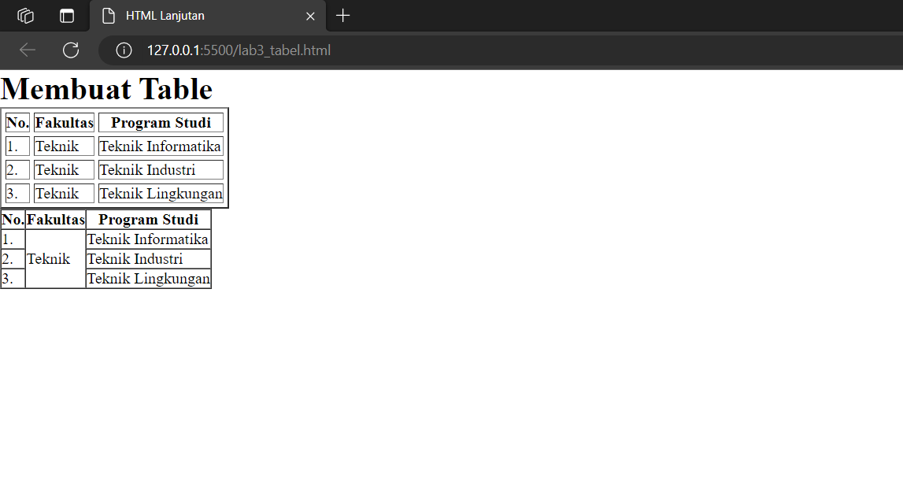
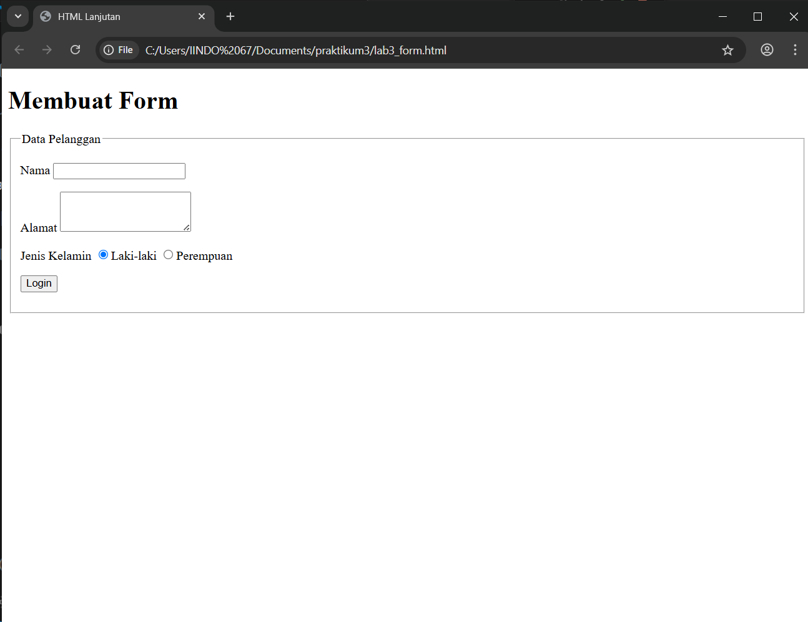
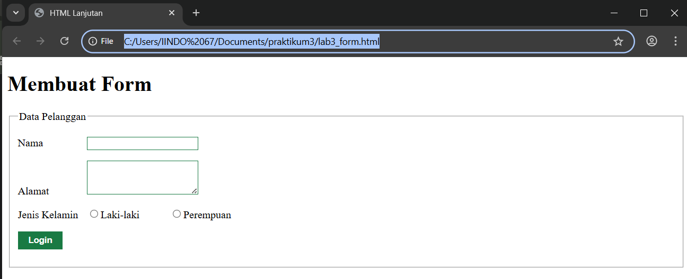
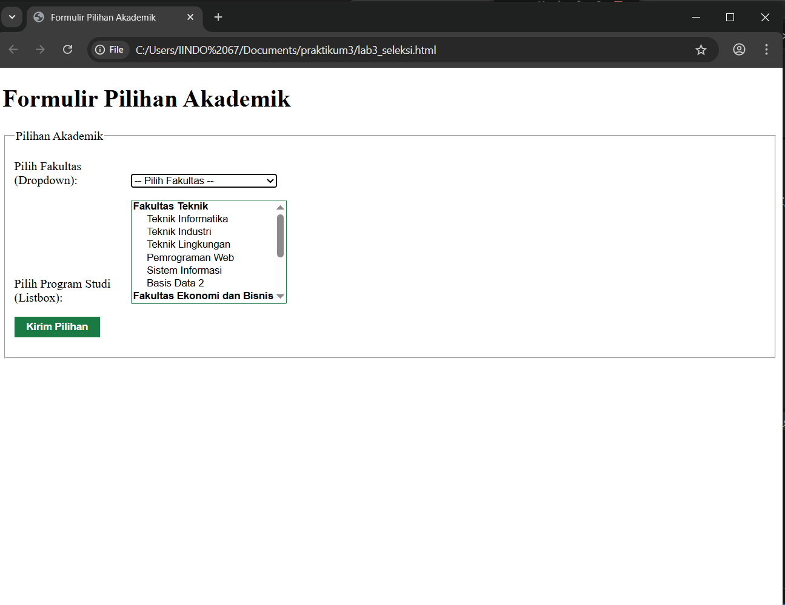

# Lab3web
Nama: Den Fahmi Satria <p>
Nim: 312410523 <p>
Kelas: TI.24.A.5 <p>
## Praktikum 3: Membuat List, Table dan Form
Persiapan pertama yaitu membuat dokumen HTML dengan nama file lab3_list.html seperti berikut.
```
<!DOCTYPE html>
<html lang="en">
<head>
<meta charset="UTF-8">
<meta name="viewport" content="width=device-width, initial-scale=1.0">
<title>HTML Lanjutan</title>
</head>
<body>
<header>
<h1>Membuat List</h1>
</header>
</body>
</html>
```
Kemudian saya tambahkan kode untuk membuat Ordered List seperti berikut.
```
<section id="order-list">
<h2>Ordered List</h2>
<ol>
<li>Pemrograman Web</li>
<li>Sistem Informasi</li>
<li>Basis Data 2</li>
</ol>
</section>
```
dan seperti inilah hasilnya <p>
 <p>
Kemudian saya tambakan kode untuk membuat Unordered List, setelah deklarasi ordered list pada
section unordered-list, seperti berikut.
```
<section id="unorder-list">
<h2>Unordered List</h2>
<ul type="square">
<li>Jaringan Komputer</li>
<li>Struktur Data</li>
<li>Algoritma &amp; Pemrograman</li>
</ul>
</section>
```
dan inilah hasilnya
 <p>
Kemudian saya tambahkan kode untuk membuat description list setelah deklarasi unorderd-list.
```
<section id="unorder-list">
<h2>Description List</h2>
<dl>
<dt>Fakultas Teknik</dt>
<dd>Teknik Industri</dd>
<dd>Teknik Informatika</dd>
<dd>Teknik Lingkungan</dd>
<dt>Fakultas Ekonomi dan Bisnis</dt>
<dd>Akuntansi</dd>
<dd>Manajemen</dd>
<dd>Bisnis Digital</dd>
</dl>
</section>
```
seperti ini hasilnya
 <p>
lalu saya Buat file baru dengan nama lab3_tabel.html seperti berikut.
```
<!DOCTYPE html>
<html lang="en">
<head>
<meta charset="UTF-8">
<meta name="viewport" content="width=device-width, initial-scale=1.0">
<title>HTML Lanjutan</title>
</head>
<body>
<header>
<h1>Membuat Table</h1>
</header>
</body>
</html>

<table border="1" cellpadding="4" cellspacing="0">
<thead>
<tr>
<th>No.</th>
<th>Fakultas</th>
<th>Program Studi</th>
</tr>
</thead>
<tbody>
<tr>
<td>1.</td>
<td>Teknik</td>
<td>Teknik Informatika</td>
</tr>
<tr>
<td>2.</td>
<td>Teknik</td>
<td>Teknik Industri</td>
</tr>
<tr>
<td>3.</td>
<td>Teknik</td>
<td>Teknik Lingkungan</td>
</tr>
</tbody>
</table>
```
Untuk mengatur margin dan padding pada cel data, tambahkan atribut cellpadding dan
cellspacing pada tag table.
```
<table border="1" cellpadding="4" cellspacing="0">
```
kemudian saya menggabungkan sel data, menggunakan atribut rowspan dan colspan.
```
<table border="1" cellpadding="6" cellspacing="0">
<thead>
<tr>
<th>No.</th>
<th>Fakultas</th>
<th>Program Studi</th>
</tr>
</thead>
<tbody>
<tr>
<td>1.</td>
<td rowspan="3">Teknik</td>
<td>Teknik Informatika</td>
</tr>
<tr>
<td>2.</td>
<td>Teknik Industri</td>
</tr>
<tr>
<td>3.</td>
<td>Teknik Lingkungan</td>
</tr>
</tbody>
</table>
```
seperti inilah hasilnya <p>
 <p>
kemudian saya membuat file baru dengan nama lab3_form.html untuk membuat form seperti berikut.
```
<!DOCTYPE html>
<html lang="en">
<head>
<meta charset="UTF-8">
<meta name="viewport" content="width=device-width, initial-scale=1.0">
<title>HTML Lanjutan</title>
</head>
<body>
<header>
<h1>Membuat Form</h1>
</header>
</body>
</html>

<form action="proses.php" method="post">
<fieldset>
<legend>Data Pelanggan</legend>
<p>
<label for="nama">Nama</label>
<input type="text" id="nama" name="nama">
</p>
<p>
<label for="alamat">Alamat</label>
<textarea id="alamat" name="alamat" cols="20" rows="3"></textarea>
</p>
<p>
<label>Jenis Kelamin</label>
<input id="jk_l" type="radio" name="kelamin" value="L" /><label
for="jk_l">Laki-laki</label>
<input id="jk_p" type="radio" name="kelamin" value="P" /><label

for="jk_p">Perempuan</label>
</p>
<p><input type="submit" value="Login"></p>
</fieldset>
</form>

for="jk_p">Perempuan</label>
</p>
<p><input type="submit" value="Login"></p>
</fieldset>
</form>
```
lalu hasilnya akan jadi seperti ini <p>
 <p>
kemudian saya tambahkan style css seperti berikut <p>
```
<style>
form p > label {
display: inline-block;
width: 100px;
}
form input[type="text"], form textarea {
border: 1px solid #197a43;
}
form input[type="submit"] {
border: 1px solid #197a43;
background-color: #197a43;
color: #ffffff;
font-weight: bold;
padding: 5px 15px;
}
</style>
```
 <p>
untuk menampilkan dropdown menu dan listbox dengan multiple selection saya membuat file baru dengan nama lab3seleksi.html sebagai berikut.
```
<!DOCTYPE html>
<html lang="en">
<head>
    <meta charset="UTF-8">
    <meta name="viewport" content="width=device-width, initial-scale=1.0">
    <title>Formulir Pilihan Akademik</title>
    <style>
        form p > label {
            display: inline-block;
            width: 150px; 
        }
        form input[type="text"], form textarea, form select {
            border: 1px solid #197a43;
        }
        form input[type="submit"] {
            border: 1px solid #197a43;
            background-color: #197a43;
            color: #ffffff;
            font-weight: bold;
            padding: 5px 15px;
            cursor: pointer;
        }
    </style>
</head>
<body>
    <header>
        <h1>Formulir Pilihan Akademik</h1>
    </header>

    <form action="proses.php" method="post">
        <fieldset>
            <legend>Pilihan Akademik</legend>

            <p>
                <label for="fakultas">Pilih Fakultas (Dropdown):</label>
                <select id="fakultas" name="fakultas">
                    <option value="">-- Pilih Fakultas --</option>
                    <option value="Teknik">Teknik</option>
                    <option value="Ekonomi dan Bisnis">Fakultas Ekonomi dan Bisnis</option>
                </select>
            </p>

            <p>
                <label for="program_studi">Pilih Program Studi (Listbox):</label>
                <select id="program_studi" name="program_studi[]" size="8" multiple>
                    <optgroup label="Fakultas Teknik">
                        <option value="Teknik Informatika">Teknik Informatika</option>
                        <option value="Teknik Industri">Teknik Industri</option>
                        <option value="Teknik Lingkungan">Teknik Lingkungan</option>
                        <option value="Pemrograman Web">Pemrograman Web</option>
                        <option value="Sistem Informasi">Sistem Informasi</option>
                        <option value="Basis Data 2">Basis Data 2</option>
                    </optgroup>
                    <optgroup label="Fakultas Ekonomi dan Bisnis">
                        <option value="Akuntansi">Akuntansi</option>
                        <option value="Manajemen">Manajemen</option>
                        <option value="Bisnis Digital">Bisnis Digital</option>
                    </optgroup>
                    <option value="Jaringan Komputer">Jaringan Komputer</option>
                    <option value="Struktur Data">Struktur Data</option>
                    <option value="Algoritma & Pemrograman">Algoritma &amp; Pemrograman</option>
                </select>
            </p>

            <p><input type="submit" value="Kirim Pilihan"></p>

        </fieldset>
    </form>
</body>
</html>
```
dan beginilah hasilnya
 <p>
