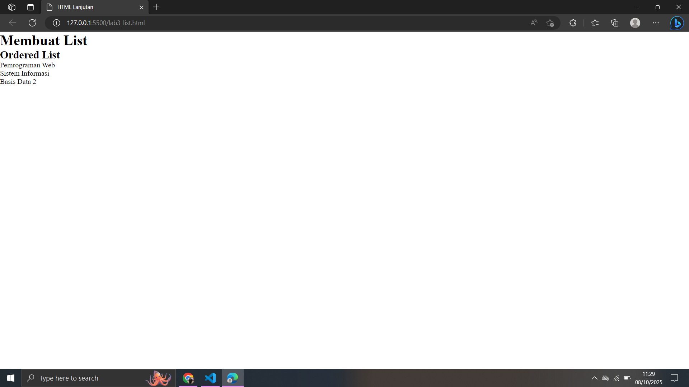
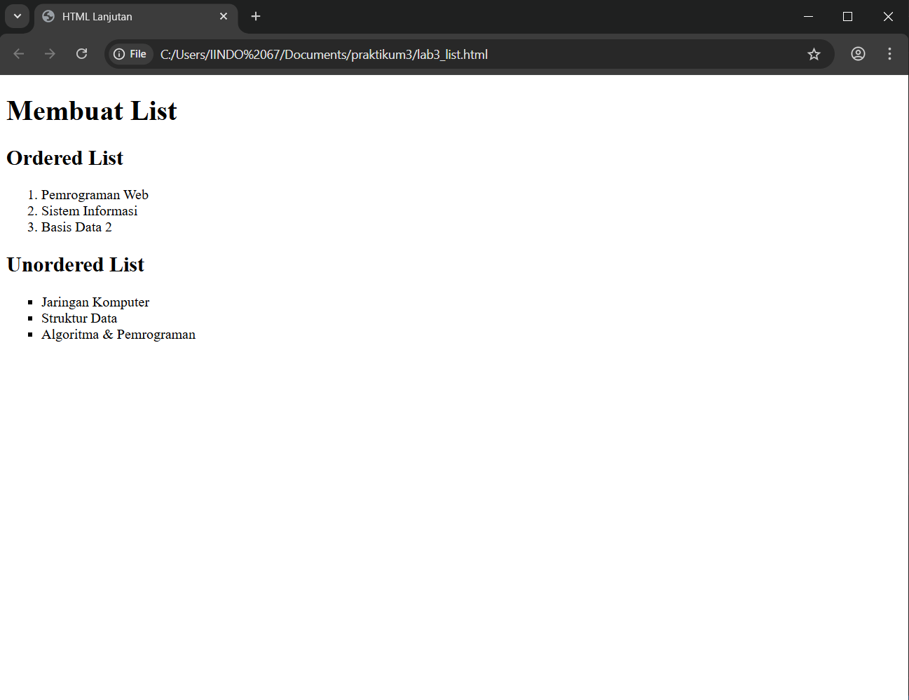
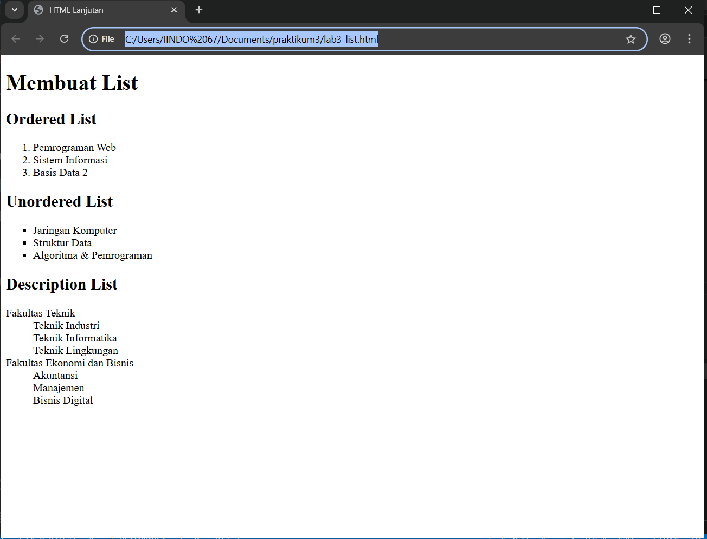

# Lab3web
Nama: Den Fahmi Satria <p>
Nim: 312410523 <p>
Kelas: TI.24.A.5 <p>
## Praktikum 3: Membuat List, Table dan Form
Persiapan pertama yaitu membuat dokumen HTML dengan nama file lab3_list.html seperti berikut.
```
<!DOCTYPE html>
<html lang="en">
<head>
<meta charset="UTF-8">
<meta name="viewport" content="width=device-width, initial-scale=1.0">
<title>HTML Lanjutan</title>
</head>
<body>
<header>
<h1>Membuat List</h1>
</header>
</body>
</html>
```
Kemudian saya tambahkan kode untuk membuat Ordered List seperti berikut.
```
<section id="order-list">
<h2>Ordered List</h2>
<ol>
<li>Pemrograman Web</li>
<li>Sistem Informasi</li>
<li>Basis Data 2</li>
</ol>
</section>
```
dan seperti inilah hasilnya <p>
 <p>
Kemudian saya tambakan kode untuk membuat Unordered List, setelah deklarasi ordered list pada
section unordered-list, seperti berikut.
```
<section id="unorder-list">
<h2>Unordered List</h2>
<ul type="square">
<li>Jaringan Komputer</li>
<li>Struktur Data</li>
<li>Algoritma &amp; Pemrograman</li>
</ul>
</section>
```
dan inilah hasilnya
 <p>
Kemudian saya tambahkan kode untuk membuat description list setelah deklarasi unorderd-list.
```
<section id="unorder-list">
<h2>Description List</h2>
<dl>
<dt>Fakultas Teknik</dt>
<dd>Teknik Industri</dd>
<dd>Teknik Informatika</dd>
<dd>Teknik Lingkungan</dd>
<dt>Fakultas Ekonomi dan Bisnis</dt>
<dd>Akuntansi</dd>
<dd>Manajemen</dd>
<dd>Bisnis Digital</dd>
</dl>
</section>
```
seperti ini hasilnya
 <p>
